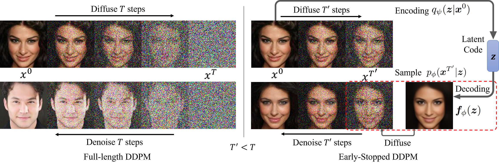

# Accelerating Diffusion Models via Early Stop of the Diffusion Process
This repo intends to release code for our work: 

Zhaoyang Lyu, Xudong XU, Ceyuan Yang, Dahua Lin, Bo Dai["Accelerating Diffusion Models via Early Stop of the Diffusion Process"](https://arxiv.org/abs/2205.12524).

We propose the Early-Stopped Denoising Diffusion Probabilistic Model (ES-DDPM) that accelerates the training and sampling process of DDPMs by adopting early stop in the diffusion process.
ES-DDPM can combine a pre-trained DDPM with another pre-trained generative model such as a VAE or GAN to form a new generative model.
The combined generative model can outperform the original DDPM in terms of both sample quality and sampling speed.
Below is a comparison between ES-DDPM and vanilla DDPM.



# Acknowledgement
This repo is based on the open-source repo for [Guided Diffusion](https://github.com/openai/guided-diffusion).


# Set up the environment
The code is tested with Pytorch 1.11.0 and CUDA 11.3.
Run the following command to install dependencies and the guided-diffusion package:
```
bash setup_env.sh
pip install -e .
```


# Download Checkpoints and Data
We use pre-trained DDPMs and GAN-generated images from the repo  [Guided Diffusion](https://github.com/openai/guided-diffusion).
Download pretrained DDPMs on 
[ImageNet-64](https://openaipublic.blob.core.windows.net/diffusion/jul-2021/64x64_diffusion.pt), 
[LSUN-Bedroom-256](https://openaipublic.blob.core.windows.net/diffusion/jul-2021/lsun_bedroom.pt), 
[LSUN-Cat-256](https://openaipublic.blob.core.windows.net/diffusion/jul-2021/lsun_cat.pt) 
from [this page](https://github.com/openai/guided-diffusion).
Move the ImageNet DDPM checkpoint to the folder `scripts/models`, and move LSUN DDPM checkpoints to the folder `scripts/models/lsun`.


Then download pre-generated 
[ImageNet-64 (BigGAN-deep)](https://openaipublic.blob.core.windows.net/diffusion/jul-2021/ref_batches/imagenet/64/biggan_deep_imagenet64.npz),  
[LSUN-Bedroom (StyleGAN)](https://openaipublic.blob.core.windows.net/diffusion/jul-2021/ref_batches/lsun/bedroom/stylegan_lsun_bedroom.npz) and 
[LSUN-Cat (StyleGAN2)](https://openaipublic.blob.core.windows.net/diffusion/jul-2021/ref_batches/lsun/cat/stylegan2_lsun_cat.npz) images 
from [this page](https://github.com/openai/guided-diffusion/tree/main/evaluations).
Move ImageNet pre-generated images to the folder `evaluations/precomputed`, and move LSUN pre-generated images to the folder `evaluations/precomputed/lsun`.

Finally, download the reference batches for FID and other metric evaluations from [this page](https://github.com/openai/guided-diffusion/tree/main/evaluations).
Download the [ImageNet reference batch](https://openaipublic.blob.core.windows.net/diffusion/jul-2021/ref_batches/imagenet/64/VIRTUAL_imagenet64_labeled.npz) and move it to the folder `evaluations/precomputed`.
Download the [LSUN-Bedroom reference batch](https://openaipublic.blob.core.windows.net/diffusion/jul-2021/ref_batches/lsun/bedroom/VIRTUAL_lsun_bedroom256.npz) and [LSUN-Cat reference batch](https://openaipublic.blob.core.windows.net/diffusion/jul-2021/ref_batches/lsun/cat/VIRTUAL_lsun_cat256.npz), and move them to the folder `evaluations/precomputed/lsun`.

# Sampling Images from ES-DDPMs

```
cd scripts
```

Run the following command to use ES-DDPM (T'=100, DDPM combined with BigGAN-deep) to generate ImageNet-64 images (with jumping interval 4):
```
python generate_processes_diffusion_and_reverse.py --classifier_guidance_scale 0 --reverse_steps 25 --chain_length 250 --dataset imagenet64 --dataset_path ../evaluations/precomputed/biggan_deep_imagenet64.npz --devices '0,1,2,3,4,5,6,7' --execute 
```

Run the following command to use ES-DDPM (T'=100, DDPM combined with StyleGAN) to generate LSUN-Bedroom-256 images:
```
python generate_processes_diffusion_and_reverse.py --reverse_steps 100 --chain_length 1000 --dataset lsun_bedroom --dataset_path ../evaluations/precomputed/lsun/stylegan_lsun_bedroom.npz --devices '0,1,2,3,4,5,6,7' --execute 
```

Run the following command to use ES-DDPM (T'=100, DDPM combined with StyleGAN2) to generate LSUN-Cat-256 images:
```
python generate_processes_diffusion_and_reverse.py --reverse_steps 100 --chain_length 1000 --dataset lsun_cat --dataset_path ../evaluations/precomputed/lsun/stylegan2_lsun_cat.npz --devices '0,1,2,3,4,5,6,7' --execute 
```

If you want to use a different T' value, you can set the argument `reverse_steps` to the corresponding value.

# Couple ES-DDPM with Timestep-Respacing and DDIM
As stated in our paper, ES-DDPM can be coupled with other DDPM acceleration methods to achieve further acceleration.
We use [Timestep-Respacing](https://github.com/openai/improved-diffusion) and [DDIM](https://github.com/ermongroup/ddim) as an illustration in our experiments.
Both Timestep-Respacing and DDIM allows us to sampling from a pre-trained ES-DDPM only on a subsequence of the original T' denoising steps. We choose a uniform subsequence in our T' denoising steps with jumping interval N.

To couple ES-DDPM with Timestep-Respacing, you only need to change the arguments `chain_length` and `reverse_steps` in the above sampling commands.
Specifically, if you want to sampling from ES-DDPM with jumping interval N, you need to set `chain_length` to `1000/N`, and set `reverse_steps` to `T'/N`.

For example, run the following command to use ES-DDPM (T'=100, DDPM combined with StyleGAN) to generate LSUN-Bedroom-256 images with a jumping interval 5:
```
python generate_processes_diffusion_and_reverse.py --reverse_steps 20 --chain_length 200 --dataset lsun_bedroom --dataset_path ../evaluations/precomputed/lsun/stylegan_lsun_bedroom.npz --devices '0,1,2,3,4,5,6,7' --execute
```

If you want to use DDIM for sampling, simply add the text `ddim` to the beginning of the argument `chain_length`:
```
python generate_processes_diffusion_and_reverse.py --reverse_steps 20 --chain_length ddim200 --dataset lsun_bedroom --dataset_path ../evaluations/precomputed/lsun/stylegan_lsun_bedroom.npz --devices '0,1,2,3,4,5,6,7' --execute 
```